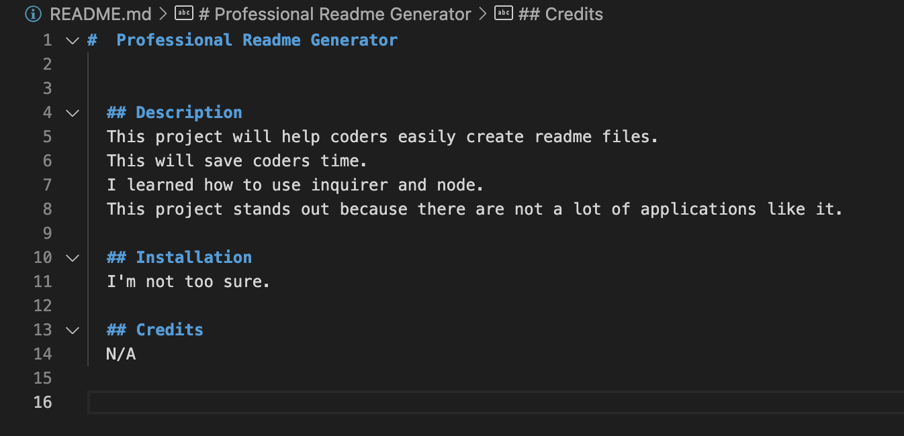

#  Professional Readme Generator

  ## Description 
  This project will help coders easily create readme files.
  This will save coders time.
  I learned how to use inquirer and node.
  This project stands out because there are not a lot of applications like it.

Git hub repo:
https://github.com/kgentel/professional-README-generator

Video link:
https://youtu.be/XpXx4qg_SzA

Image of readme created with application
